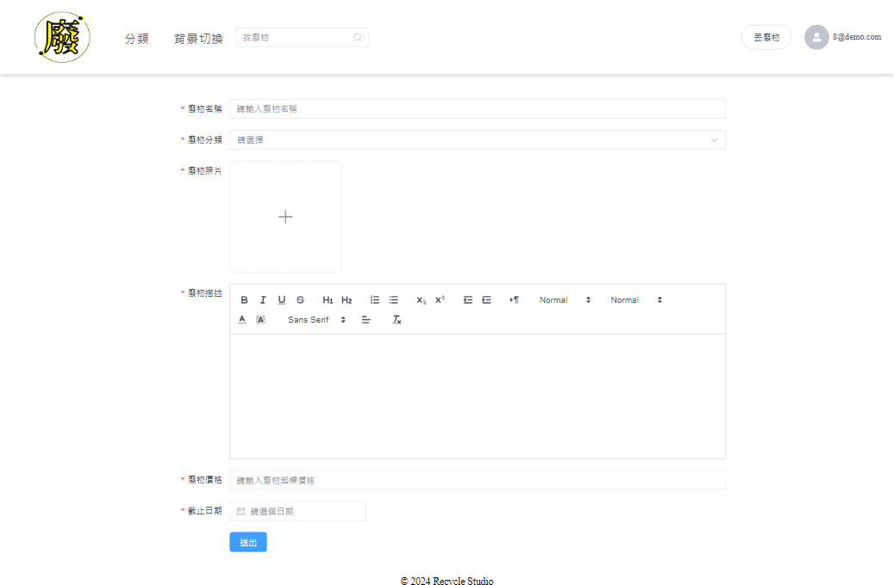

# garbage exchange station

DEMO:[garbage_exchange_station](https://dashuchiu.github.io/demo/#/main)  
使用vue3、樣式框架為Element UI開發的廢物交換網站。
+ 前端框架： Vue3 + Vue router + pinia + axios
+ 前端UI框架及樣式: Element UI/SCSS
+ 打包工具: Vite

## 登入

功能:  
+ JWT實現token-based登入、註冊驗證機制。    
      

## 收藏

功能:  
+ 加入/取消收藏。
 
      

## i18n語言切換

功能:  
+ 中英文切換。
 

## 查找

功能:  
+ 搜尋廢物。
 

## vue-quill編輯器

功能:  
+ 使用編輯器新增廢物。
 

